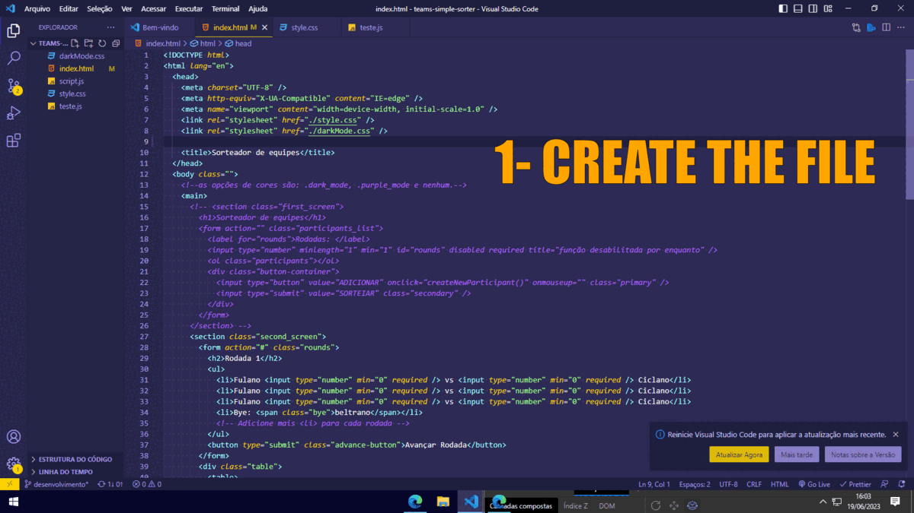

<h1>HOW TO USE THE COMPONENT</h1>

<h2>HTML</h2>
<h3>Import the index on the top of your header of the page, like:</h3>
<pre>
<code>    
&#60;header>
 <strong title="Code inserted">&#60;div class="theme_selector" aria-disabled="true" aria-hidden="true">
    &#60;div class="shortcut-text bye">
      &#60;em
        >&#60;p>ctrl +&#60;/p>
        alt gr&#60;/em
      >
    &#60;/div>
    &#60;input type="radio" name="color" class="theme-circle light-mode" tabindex="-1" checked />
    &#60;input type="radio" name="color" class="theme-circle purple-mode" tabindex="-1" />
    &#60;input type="radio" name="color" class="theme-circle dark-mode" tabindex="-1" />
    &#60;input type="radio" name="color" class="theme-circle blue-mode" tabindex="-1" />
  &#60;/div>
  &#60;div class="sensor_selector" onmouseover="showSelector()" onmouseout="hideSelector()" aria-disabled="true" aria-hidden="true">&#60;/div></strong> 
  &#60;img src="./assets/img/Alura Logo.svg" alt="Logo Alura" />
  &#60;h1>Decodificador&#60;/h1>
&#60;/header>
</code>
</pre>

If you want to change the default theme, move the <em>checked</em> to other input.

 
 
<h2>CSS</h2>
<h3>Import the style.css in your stylesheet, before mediaqueries. Follow the instructions in style.css</h3>

  You will need to create some extra files, each one for each theme, and import to your page. it doesn't have need to create a new file to the default theme   

  In the above example, we have 4 themes. So, I'll need to create 3 extra files. In the below example, I create the purple-mode:   

 
 
<h2>JS</h2>
<h3>Import the script.js to your script. It's a good idea to add a dark-mode detection in the script.</h3>
